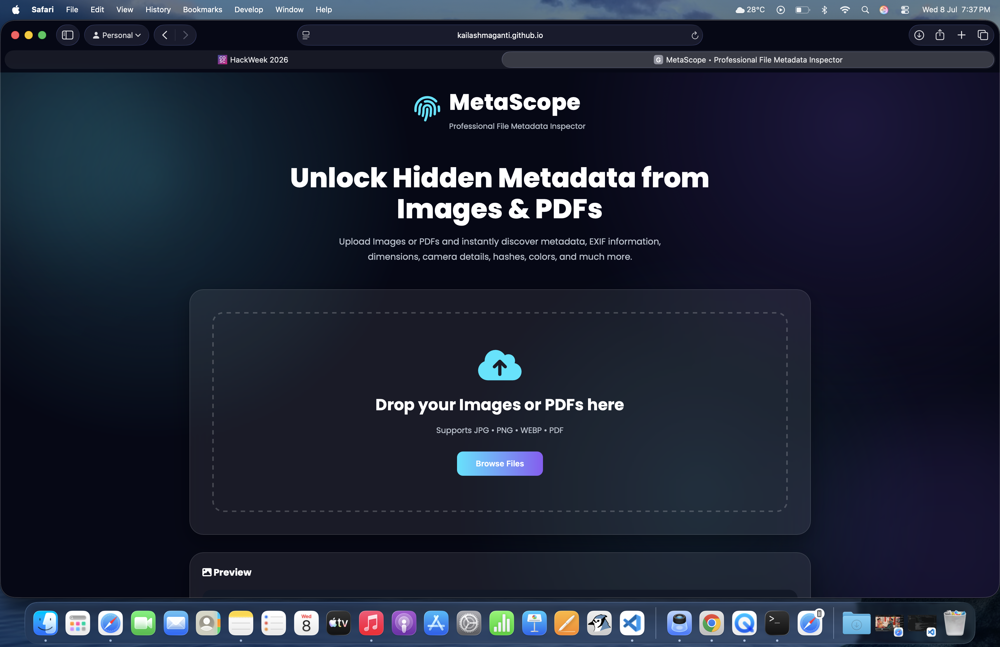
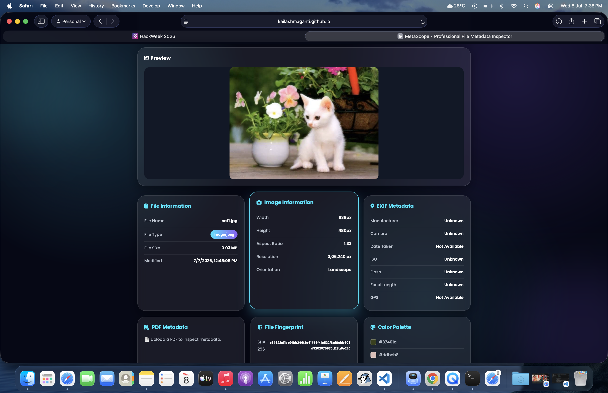
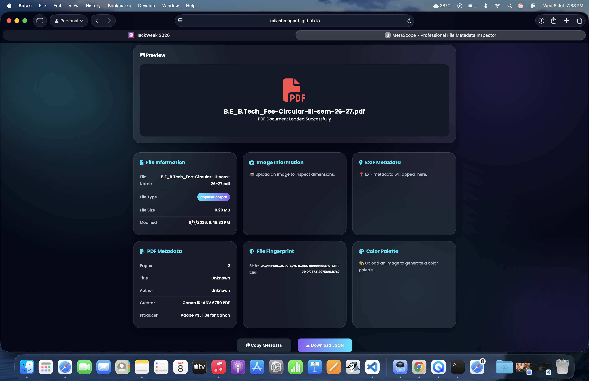

# 🔍 MetaScope

> **Professional File Metadata Inspector**

MetaScope is a modern web application that extracts and displays metadata from uploaded **Images** and **PDF** files. It provides detailed file information, EXIF metadata, SHA-256 hashing, PDF inspection, and automatic color palette generation through a clean and responsive interface.

---

## 🌐 Live Demo

**GitHub Pages**

https://kailashmaganti.github.io/MetaScope/

---

## 📂 GitHub Repository

https://github.com/kailashmaganti/MetaScope

---

# ✨ Features

- 📁 Drag & Drop file upload
- 📂 Browse Files button
- 🖼 Image preview
- 📄 PDF preview
- 📏 Image dimensions
- 📐 Aspect ratio calculation
- 📸 EXIF metadata extraction
- 📷 Camera manufacturer & model
- 📅 Date Taken
- 🌍 GPS information (if available)
- 📑 PDF metadata extraction
- 🔒 SHA-256 File Fingerprint
- 🎨 Automatic Color Palette Generation
- 📋 Copy Metadata to Clipboard
- 💾 Download Metadata as JSON
- 📱 Responsive Design
- 💎 Modern Glassmorphism UI

---

# 🛠 Technologies Used

- HTML5
- CSS3
- JavaScript (ES6)
- Browser File API
- Web Crypto API
- EXIF.js
- PDF.js
- ColorThief.js

---

# ⚙️ Setup Instructions

### 1. Clone the repository

```bash
git clone https://github.com/kailashmaganti/MetaScope.git
```

---

### 2. Open the project

Open the project folder in **Visual Studio Code**.

---

### 3. Run the project

You can either:

- Open `index.html` directly in your browser

OR

- Use the **Live Server** extension in Visual Studio Code.

---

### 4. Upload a file

Upload an **Image** or **PDF** to inspect its metadata.

---

# 📸 Demo Screenshots

## 🏠 Home Page



---

## 🖼 Image Metadata Analysis



---

## 📄 PDF Metadata Analysis



---

# 📂 Project Structure

```text
MetaScope
│
├── screenshots
│   ├── home.png
│   ├── image-analysis.png
│   └── pdf-analysis.png
│
├── index.html
├── style.css
├── script.js
├── README.md
└── .gitignore
```

---

# 🎯 Challenge Requirements Covered

✅ Upload Images

✅ Upload PDFs

✅ File Size

✅ MIME Type

✅ Image Dimensions

✅ Last Modified Date

✅ EXIF Metadata

✅ Camera Information

✅ GPS Information (when available)

✅ PDF Metadata

✅ SHA-256 Fingerprint

---

# 🚀 Future Improvements

- Support for additional file formats
- Metadata export as CSV
- Image histogram visualization
- Batch file analysis
- Advanced metadata comparison

---

# 👨‍💻 Author

**Kailash Maganti**

GitHub:
https://github.com/kailashmaganti

---

# 📜 License

This project was developed as part of the **HackWeek 2026** challenge organized by the **CBIT Open Source Community (COSC)**.
